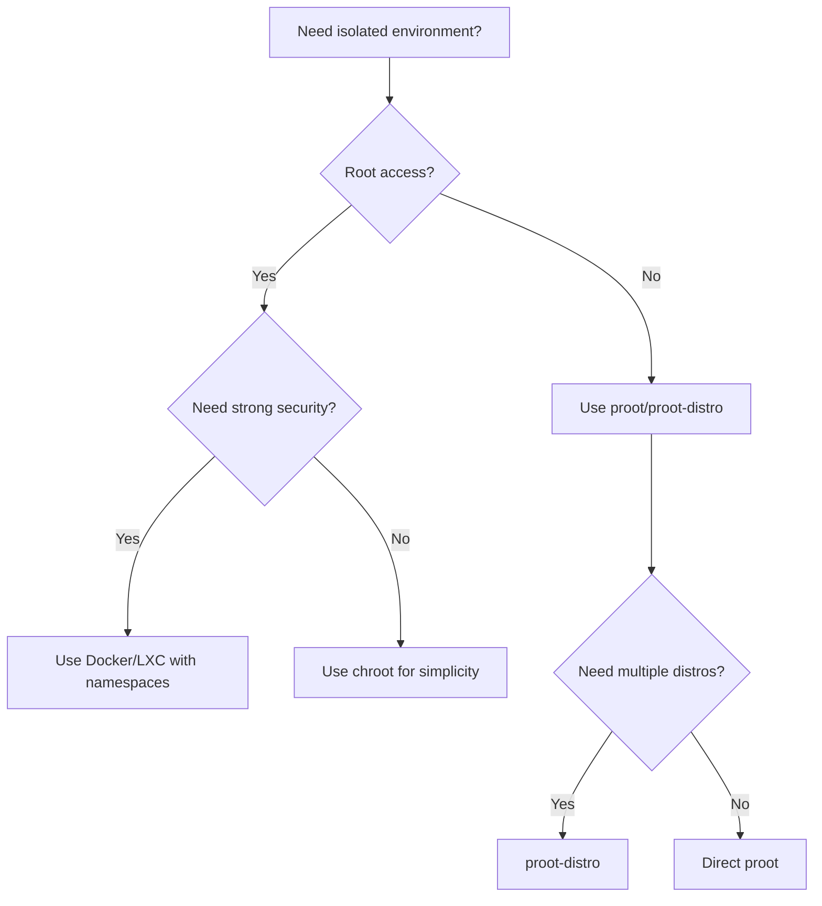

# Operating Systems Deep Dive: Architecture, Isolation, and Environment Management
## Understanding chroot, proot, and proot-distro in the Context of OS Theory

---

## Table of Contents
1. [What is an Operating System?](#1-what-is-an-operating-system)
2. [OS Architecture Fundamentals](#2-os-architecture-fundamentals)
3. [Kernel Space vs User Space](#3-kernel-space-vs-user-space)
4. [System Calls: The OS Interface](#4-system-calls-the-os-interface)
5. [Process Management & Execution](#5-process-management--execution)
6. [Filesystem Abstraction & Isolation](#6-filesystem-abstraction--isolation)
7. [Virtualization & Abstraction Layers](#7-virtualization--abstraction-layers)
8. [chroot: Filesystem Isolation Primitive](#8-chroot-filesystem-isolation-primitive)
9. [proot: User-Space System Call Interception](#9-proot-user-space-system-call-interception)
10. [proot-distro: Distribution Management Layer](#10-proot-distro-distribution-management-layer)
11. [Comparative Analysis](#11-comparative-analysis)
12. [Security Considerations](#12-security-considerations)
13. [Cross-Platform OS Context](#13-cross-platform-os-context)
14. [References & Further Reading](#14-references--further-reading)

---

## 1. What is an Operating System?

### Definition
An **Operating System (OS)** is system software that manages computer hardware, software resources, and provides common services for computer programs [[10]]. It acts as an intermediary between users/applications and the computer hardware.

### Core Functions
| Function | Description | Example |
|----------|-------------|---------|
| **Process Management** | Creates, schedules, and terminates processes | `fork()`, `exec()`, `wait()` |
| **Memory Management** | Allocates/deallocates memory, handles virtual memory | Paging, segmentation, MMU |
| **File System Management** | Organizes, stores, retrieves data on storage devices | ext4, NTFS, FAT32 |
| **Device Management** | Controls hardware via drivers and I/O operations | Block/character devices |
| **Security & Protection** | Enforces access control, user permissions | DAC, MAC, capabilities |
| **System Call Interface** | Provides controlled entry point to kernel services | `read()`, `write()`, `open()` |

### OS Kernel Architectures
```
┌─────────────────────────────────────────┐
│ MONOLITHIC KERNEL (Linux, BSD, Windows) │
├─────────────────────────────────────────┤
│ • All core OS services run in kernel space │
│ • High performance (no context switches) │
│ • Lower modularity, higher complexity    │
│ • Single address space for kernel code   │
└─────────────────────────────────────────┘

┌─────────────────────────────────────────┐
│ MICROKERNEL (Minix, QNX, L4, Fuchsia)   │
├─────────────────────────────────────────┤
│ • Minimal kernel: IPC, scheduling, MMU   │
│ • Services run in user space (drivers, FS)│
│ • Higher modularity, better fault isolation│
│ • More context switches = potential overhead│
└─────────────────────────────────────────┘

┌─────────────────────────────────────────┐
│ HYBRID KERNEL (Windows NT, macOS XNU)   │
├─────────────────────────────────────────┤
│ • Combines monolithic performance with  │
│   microkernel modularity                │
│ • Critical services in kernel, others   │
│   optionally in user space              │
└─────────────────────────────────────────┘
```
[[61]][[62]][[67]]

---

## 2. OS Architecture Fundamentals

### Layered Abstraction Model
```
┌─────────────────────┐
│    Applications     │  ← User programs (bash, python, nginx)
├─────────────────────┤
│   System Libraries  │  ← glibc, musl (wrap syscalls)
├─────────────────────┤
│   System Call API   │  ← Interface to kernel (syscall instruction)
├─────────────────────┤
│      Kernel         │  ← Core OS: scheduler, MMU, VFS, drivers
├─────────────────────┤
│      Hardware       │  ← CPU, RAM, disk, network, peripherals
└─────────────────────┘
```

### Key Abstractions Provided by OS
1. **Process**: An executing program with isolated address space
2. **Thread**: Lightweight execution unit within a process
3. **Virtual Memory**: Abstraction of physical RAM with paging/swapping
4. **File**: Abstraction of storage as byte streams with metadata
5. **Device**: Uniform interface to hardware via device files
6. **Network Socket**: Abstraction for inter-process communication

---

## 3. Kernel Space vs User Space

### Memory Protection Model
Modern operating systems enforce a strict separation between two execution modes [[1]][[5]]:

| Aspect | User Space | Kernel Space |
|--------|-----------|--------------|
| **Privilege Level** | Ring 3 (least privileged) | Ring 0 (most privileged) |
| **Memory Access** | Restricted to process virtual address space | Full access to physical/virtual memory |
| **Instruction Set** | Limited (no privileged instructions) | Full CPU instruction set |
| **Purpose** | Run applications safely | Manage hardware, enforce policies |

### Transition Mechanism: System Calls
```c
// User-space application requests kernel service
ssize_t read(int fd, void *buf, size_t count) {
    // 1. Arguments placed in registers
    // 2. syscall instruction triggers mode switch (user→kernel)
    // 3. Kernel validates parameters, performs operation
    // 4. Result returned, mode switch back (kernel→user)
    return syscall(SYS_read, fd, buf, count);
}
```
[[7]][[8]]

> **Critical Insight**: Every interaction with hardware, filesystem, or other processes requires crossing the user/kernel boundary via system calls.

---

## 4. System Calls: The OS Interface

### What is a System Call?
A **system call** is a controlled entry point into the kernel, allowing user-space programs to request privileged operations [[6]][[74]].

### Common System Call Categories
```bash
# Process Control
fork(), execve(), exit(), waitpid(), getpid()

# File Operations  
open(), read(), write(), close(), stat(), chmod()

# Device I/O
ioctl(), mmap(), select(), poll()

# Communication
pipe(), socket(), bind(), connect(), send(), recv()

# Memory Management
brk(), mmap(), munmap()

# Information
uname(), getuid(), getgid(), time()
```

### System Call Table (Linux x86_64 Example)
```
NR    Name                Entry Point
─────────────────────────────────────
0     read                sys_read
1     write               sys_write
2     open                sys_open
3     close               sys_close
4     stat                sys_newstat
...
231   getuid              sys_getuid
232   sysctl              sys_sysctl
```
[[70]][[74]][[77]]

> **Note**: System call numbers and interfaces vary by architecture (x86, ARM64, RISC-V) and OS.

---

## 5. Process Management & Execution

### Process Lifecycle
```
[Created] → [Ready] → [Running] → [Waiting] → [Terminated]
                ↑          ↓
                └──[Preempted/Scheduled]──┘
```

### Key Process Attributes
- **PID**: Unique process identifier
- **Address Space**: Virtual memory layout (code, data, heap, stack)
- **File Descriptor Table**: Open files/sockets
- **Credentials**: UID, GID, capabilities
- **Namespace Memberships**: Isolation contexts (see §6)

### Context Switching Overhead
When the OS switches between processes:
1. Save current process state (registers, program counter)
2. Update memory management unit (page tables)
3. Load next process state
4. Resume execution

> This overhead is why lightweight isolation (containers) is preferred over full virtualization for many use cases.

---

## 6. Filesystem Abstraction & Isolation

### Virtual Filesystem (VFS) Layer
The OS provides a **VFS abstraction** that unifies access to different filesystem types (ext4, XFS, NFS, etc.) through a common API [[81]][[83]].

### Isolation Mechanisms Compared

| Mechanism | Scope | Kernel Support | Security Boundary |
|-----------|-------|---------------|-------------------|
| **chroot** | Filesystem root only | Yes (syscall) | ❌ Weak (escape possible) |
| **Mount Namespace** | Entire mount table | Yes (Linux 2.4.19+) | ✅ Strong (with proper setup) |
| **pivot_root** | Root filesystem swap | Yes (syscall) | ✅ Stronger than chroot |
| **proot** | Path redirection (user-space) | No (ptrace-based) | ❌ Not a security boundary |

### chroot: The Original Filesystem Jail
```c
// chroot() system call signature
int chroot(const char *path);
// Changes the root directory for the calling process and its children
// After chroot("/jail"), "/etc/passwd" refers to "/jail/etc/passwd"
```
[[16]][[17]]

**Limitations of chroot**:
- Does not isolate processes, network, users, or devices [[78]][[80]]
- Privileged processes can escape via `..` traversal or device access
- Requires root privileges to invoke

### Modern Alternative: Namespaces
Linux namespaces provide comprehensive isolation [[84]]:
```bash
# Create isolated environment using namespaces
unshare --mount --uts --ipc --net --pid --user --fork /bin/bash
```

| Namespace Type | Isolates |
|---------------|----------|
| `mount` | Filesystem mount points |
| `pid` | Process ID numbering |
| `net` | Network interfaces, routing, firewall |
| `uts` | Hostname and domain name |
| `ipc` | Inter-process communication (shared memory, semaphores) |
| `user` | User and group IDs |
| `cgroup` | Resource limits and accounting |

> **Key Insight**: Containers (Docker, LXC) combine namespaces + cgroups + filesystem isolation for lightweight virtualization [[79]][[85]].

---

## 7. Virtualization & Abstraction Layers

### Virtualization Spectrum
```
Hardware Virtualization (VMs)
├─ Full virtualization (QEMU/KVM, VMware)
├─ Para-virtualization (Xen PV)
│
OS-Level Virtualization (Containers)
├─ Namespaces + cgroups (Docker, LXC)
├─ chroot-based (legacy)
│
Library/Emulation Layer
├─ proot (syscall interception)
├─ QEMU user-mode (CPU instruction translation)
├─ Wine (Windows API → POSIX translation)
│
Application Sandbox
├─ seccomp-bpf (syscall filtering)
├─ gVisor (user-space kernel)
```
[[87]][[89]][[93]]

### Abstraction Layer Trade-offs
| Layer | Performance | Compatibility | Isolation | Setup Complexity |
|-------|------------|---------------|-----------|-----------------|
| Hardware VM | Low | High (full OS) | Strong | High |
| Container | High | Medium (same kernel) | Medium | Medium |
| proot/QEMU-user | Medium | High (cross-arch) | Weak | Low |
| chroot | Native | Low (same arch) | Weak | Medium |

---

## 8. chroot: Filesystem Isolation Primitive

### Technical Implementation
```bash
# Manual chroot setup (requires root)
sudo mkdir -p /chroot/ubuntu
sudo debootstrap stable /chroot/ubuntu  # Populate rootfs

# Mount virtual filesystems for functionality
sudo mount -t proc /proc /chroot/ubuntu/proc
sudo mount -t sysfs /sys /chroot/ubuntu/sys
sudo mount --rbind /dev /chroot/ubuntu/dev

# Enter the environment
sudo chroot /chroot/ubuntu /bin/bash
```

### How chroot Works Internally
1. Kernel maintains `fs_struct` per process containing `root` and `pwd` dentries
2. `chroot(path)` updates the process's `fs_struct->root` to the new path
3. Subsequent path resolution starts from the new root [[11]][[15]]

### Why chroot Isn't Secure
```bash
# Escape technique (if process has capabilities or is privileged):
cd /
mkdir exploit
chroot exploit
cd ..  # Now outside the jail!
```
[[16]][[82]]

> **Rule**: chroot is for *convenience*, not *security*. Use namespaces + seccomp + capabilities for real isolation.

---

## 9. proot: User-Space System Call Interception

### Core Concept
**proot** is a user-space implementation of `chroot`, `mount --bind`, and `binfmt_misc` that requires **no root privileges** [[41]].

### How proot Works: ptrace Interception
```
┌─────────────────────────────────────┐
│ proot (tracer process)              │
│  • Attaches to target via ptrace()  │
│  • Intercepts all syscalls          │
│  • Modifies path arguments on-the-fly│
│  • Emulates privileged operations   │
└────────┬────────────────────────────┘
         │ ptrace(PTRACE_SYSCALL, ...)
         ▼
┌─────────────────────────────────────┐
│ target process (tracee)             │
│  • Executes normally                │
│  • Syscalls paused before/after     │
│  • Registers/memory inspectable     │
└─────────────────────────────────────┘
```
[[24]][[27]][[55]]

### ptrace() System Call Mechanics
```c
// Tracer attaches to tracee
ptrace(PTRACE_ATTACH, pid, NULL, NULL);

// Wait for syscall entry/exit
waitpid(pid, &status, 0);

// Inspect/modify registers
struct user_regs_struct regs;
ptrace(PTRACE_GETREGS, pid, NULL, &regs);
regs.rdi = new_path;  // Modify syscall argument
ptrace(PTRACE_SETREGS, pid, NULL, &regs);

// Resume execution
ptrace(PTRACE_SYSCALL, pid, NULL, NULL);
```
[[27]][[50]][[54]]

### proot Key Features
| Feature | Implementation |
|---------|---------------|
| **Rootfs redirection** | Intercept `open()`, `stat()`, etc.; rewrite path arguments |
| **Bind mounts** | Maintain internal path mapping table; apply during syscall interception |
| **Cross-architecture** | Integrate with QEMU user-mode for CPU instruction translation |
| **User emulation** | Fake `getuid()`, `getgid()` to simulate root inside proot |
| **Personality** | Modify `uname()` results to hide proot environment |

### Basic Usage
```bash
# Run command with alternate root
proot -r /path/to/rootfs /bin/bash

# Bind mount host directory
proot -b /host/path:/guest/path -r /rootfs /bin/bash

# Enable QEMU for cross-architecture execution
proot -q qemu-aarch64 -r /arm64-rootfs /bin/bash

# Verbose debugging
proot -v 9 -r /rootfs /bin/bash  # Levels 1-9 for verbosity
```

### Performance Characteristics
- **Overhead**: ~10-30% due to ptrace context switches [[24]]
- **Bottlenecks**: High-frequency syscalls (e.g., `stat` in package managers)
- **Optimizations**: proot caches path mappings; use `-0` for minimal interception

> **Critical Limitation**: proot is **not a security boundary**. A malicious process can potentially escape via ptrace vulnerabilities or side-channels [[41]].

---

## 10. proot-distro: Distribution Management Layer

### Architecture Overview
```
proot-distro (shell script)
├─ Downloads pre-built rootfs tarballs
├─ Configures DNS, hosts, resolv.conf
├─ Sets up login scripts and environment
├─ Manages multiple distro installations
└─ Wraps proot with sensible defaults
```
[[46]][[48]]

### Supported Distributions (Termux)
```bash
proot-distro list
# Output includes:
# alpine, archlinux, debian, fedora, 
# kali, ubuntu, void, centos, ...
```

### Installation & Usage Workflow
```bash
# 1. Install proot-distro (Termux)
pkg update && pkg install proot-distro

# 2. Install a distribution
proot-distro install ubuntu

# 3. Login to the environment
proot-distro login ubuntu

# 4. Advanced options
proot-distro login ubuntu \
  --user root \              # Login as root
  --shared-tmp \             # Share /tmp with host
  --bind /sdcard:/mnt/sdcard \  # Bind mount external storage
  -- /bin/bash -c "apt update"  # Run single command
```

### Under the Hood: What proot-distro Does
```bash
# Simplified representation of login command:
proot \
  --rootfs=/data/data/com.termux/files/usr/var/proot-distro/ubuntu \
  --bind=/data/data/com.termux/files/home:/home \
  --bind=/data/data/com.termux/files/usr/tmp:/tmp \
  --qemu=$QEMU_PATH \          # If cross-arch
  --kill-on-exit \
  /bin/bash --login
```

### Customization: Adding a New Distro
```bash
# Create distro config in ~/.config/proot-distro/
cat > mydistro.conf <<'EOF'
[mydistro]
name=My Custom Distro
arch=aarch64
tarball_url=https://example.com/rootfs.tar.xz
tarball_checksum=sha256:abc123...
default_user=myuser
EOF

# Install and use
proot-distro install mydistro
proot-distro login mydistro
```

---

## 11. Comparative Analysis

### Technical Comparison Matrix
| Feature | chroot | proot | proot-distro | Docker/LXC |
|---------|--------|-------|--------------|------------|
| **Root Required** | ✅ Yes | ❌ No | ❌ No | ⚠️ Setup only |
| **Kernel Support** | Native syscall | User-space (ptrace) | User-space (ptrace) | Namespaces + cgroups |
| **Architecture Flexibility** | Same as host | Same + QEMU cross-arch | Same + QEMU cross-arch | Same as host |
| **Filesystem Isolation** | Basic (root only) | Advanced (path rewriting) | Advanced (via proot) | Strong (mount ns) |
| **Process Isolation** | ❌ None | ❌ None | ❌ None | ✅ PID namespace |
| **Network Isolation** | ❌ None | ❌ None | ❌ None | ✅ Net namespace |
| **Performance Overhead** | None | Medium (ptrace) | Medium (ptrace) | Low (native) |
| **Security Boundary** | ❌ Weak | ❌ None | ❌ None | ✅ Strong (with config) |
| **Setup Complexity** | High (manual mounts) | Low | Very Low | Medium |
| **Primary Use Case** | System recovery, testing | Android/Linux user envs | Termux mobile Linux | Server containerization |

### When to Use Which?


---

## 12. Security Considerations

### Threat Model for Each Tool

#### chroot
- **Escape vectors**: Privileged processes, device access, `..` traversal [[16]]
- **Mitigation**: Drop capabilities, use with namespaces, avoid running as root inside

#### proot
- **Fundamental limitation**: ptrace is a debugging interface, not isolation [[41]]
- **Risks**: 
  - Tracer can be killed, releasing tracee
  - Side-channel attacks via timing/memory
  - ptrace vulnerabilities in kernel
- **Never use for**: Untrusted code execution, multi-tenant environments

#### proot-distro
- Inherits all proot risks
- Additional risk: Pre-built rootfs could contain malicious payloads
- **Mitigation**: Verify tarball checksums, use trusted sources

### Secure Alternatives
```bash
# For real isolation on Linux:
# 1. User namespaces + seccomp
unshare --user --map-root-user --fork /bin/bash

# 2. Bubblewrap (lightweight container runtime)
bwrap --ro-bind / / --dev /dev --proc /proc -- /bin/bash

# 3. Firejail (application sandboxing)
firejail --net=none --private /tmp /bin/bash

# 4. Full containers (Docker/Podman)
podman run --rm -it ubuntu:latest /bin/bash
```

> **Golden Rule**: If security matters, assume user-space interception (proot) provides **zero** isolation. Use kernel-enforced mechanisms (namespaces, seccomp, SELinux).

---

## 13. Cross-Platform OS Context

### Beyond Linux: OS Variants & Compatibility

| OS Family | chroot Support | proot Compatibility | Notes |
|-----------|---------------|---------------------|-------|
| **Linux** | ✅ Native | ✅ Full | Primary target |
| **Android** | ⚠️ Limited (requires root) | ✅ Via Termux | proot-distro optimized for Android |
| **BSD (Free/Open/Net)** | ✅ Native | ⚠️ Partial (ptrace differences) | May require patches |
| **macOS** | ✅ Native | ❌ No (ptrace restricted) | SIP limits debugging interfaces |
| **Windows (WSL2)** | ✅ Via Linux kernel | ⚠️ Experimental | WSL1 lacks full syscall support |
| **Windows (Native)** | ❌ No | ❌ No | Use Cygwin/MSYS2 for POSIX layer |

### Architecture Translation: QEMU User Mode
proot integrates with QEMU to enable cross-architecture execution:
```bash
# Run ARM64 binary on x86_64 host
proot -q qemu-aarch64 -r /arm64-rootfs /bin/bash

# How it works:
# 1. proot intercepts execve() of ARM64 binary
# 2. Spawns qemu-aarch64 with binary as argument
# 3. QEMU translates ARM64 instructions to x86_64
# 4. proot continues intercepting syscalls from translated process
```
[[41]]

> **Performance Note**: CPU emulation adds 2-10x overhead. Use only when necessary.

---

## 14. References & Further Reading

### Official Documentation
- [Linux man-pages: chroot(1), chroot(2)](https://man7.org/linux/man-pages/man2/chroot.2.html)
- [proot GitHub Repository](https://github.com/proot-me/PRoot)
- [Termux proot-distro Wiki](https://wiki.termux.com/wiki/Proot-distro)
- [ptrace(2) man page](https://man7.org/linux/man-pages/man2/ptrace.2.html)

### Operating System Theory
- [Operating Systems: Three Easy Pieces](https://pages.cs.wisc.edu/~remzi/OSTEP/)
- [Linux Kernel Development (Robert Love)](https://www.oreilly.com/library/view/linux-kernel-development/0321194047/)
- [The Design of the UNIX Operating System (Maurice Bach)](https://en.wikipedia.org/wiki/The_Design_of_the_UNIX_Operating_System)

### Security & Isolation
- [Linux Namespaces (Michael Kerrisk)](https://lwn.net/Articles/531114/)
- [Container Security (Liz Rice)](https://www.aquasec.com/resources/container-security-book/)
- [seccomp-bpf Documentation](https://www.kernel.org/doc/html/latest/userspace-api/seccomp_filter.html)

### Practical Guides
- [Building Minimal Containers from Scratch](https://blog.lizzie.io/containers-are-just-chroot.html)
- [Termux: Running Linux on Android](https://wiki.termux.com/wiki/Main_Page)
- [Cross-compilation with QEMU user-mode](https://wiki.debian.org/QemuUserEmulation)

---

> **Final Thought**: Understanding *why* tools like chroot, proot, and proot-distro exist requires grasping fundamental OS concepts: privilege separation, system calls, and abstraction layers. These tools are powerful for development and experimentation—but always match the tool to the threat model. When in doubt, prefer kernel-enforced isolation over user-space emulation.
